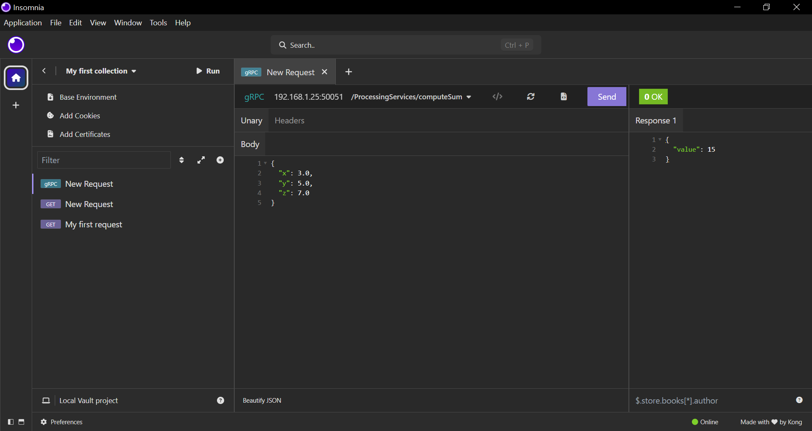

# gRPC Cross-Platform Docker Example

This example demonstrates how to build and run a gRPC C++ server and a Python client using Docker. The setup allows you to run both components in isolated containers, and also test the service using an API client from the same or another machine.

## Build and Setup

1. **Navigate to the project directory:**
    ```sh
    cd ./06_grpc_cross_platform_docker
    ```

2. **Build the Docker image:**
    ```sh
    docker build -t mygrpc .
    ```
    This creates a Docker image named `mygrpc` with all dependencies installed.

3. **List Docker images (optional):**
    ```sh
    docker images
    ```

4. **Create a Docker network for communication:**
    ```sh
    docker network create grpc-net
    ```

## Run the Server

Start the gRPC C++ server in a container:

```sh
docker run -d \
  --net grpc-net \
  -p 50051:50051 \
  --name grpc-server \
  -v .:/root \
  mygrpc \
  sh -c "mkdir -p /root/cmake/build && cd /root/cmake/build/ && cmake ../.. && make && ./server"
```

- `-p 50051:50051` exposes the gRPC port to your host.
- `-v .:/root` mounts the current directory inside the container.
- `--net grpc-net` connects the container to the custom network.

View server logs:

```sh
docker logs -f grpc-server
```

## Run the Client

Start the Python client in a separate container:

```sh
docker run -d \
  --net grpc-net \
  --name grpc-client \
  -v .:/root \
  mygrpc \
  sh -c "cd /root && python3 -m grpc_tools.protoc -I./protos --python_out=. --pyi_out=. --grpc_python_out=. ./protos/hello.proto && python3 client.py"
```

View client logs:

```sh
docker logs -f grpc-client
```

## Running the Client from Another Machine

You can also run the client from a different machine:

1. **Expose the client port if you want to access client logs or interact with the client container from another machine:**
    - Add `-p 50051:50051` to the client container:
      ```sh
      docker run -d \
        --net grpc-net \
        -p 50051:50051 \
        --name grpc-client \
        -v .:/root \
        mygrpc \
        sh -c "cd /root && python3 -m grpc_tools.protoc -I./protos --python_out=. --pyi_out=. --grpc_python_out=. ./protos/hello.proto && python3 client.py"
      ```

3. **Update the server address in `client.py`:**
    - Change the line in `client.py`:
      ```python
      # Change this to the server's IP address if running remotely
      channel = grpc.insecure_channel('grpc-server:50051')
      ```
      For example, if your server's IP is `192.168.1.25`:
      ```python
      channel = grpc.insecure_channel('192.168.1.25:50051')
      ```

4. **Run the client on your machine after generating the Python gRPC code.**

## Testing with Insomnia or Similar API Clients

You can use an API client program like [Insomnia](https://insomnia.rest/) to test your gRPC service from the same machine or another machine.

- Select your `.proto` file in Insomnia.
- Set the request body to:
    ```json
    {
        "x": 3.0,
        "y": 5.0,
        "z": 7.0
    }
    ```
- Send the request to the server's gRPC endpoint.

You should receive a response like:
```json
{
    "value": 15
}
```



---

